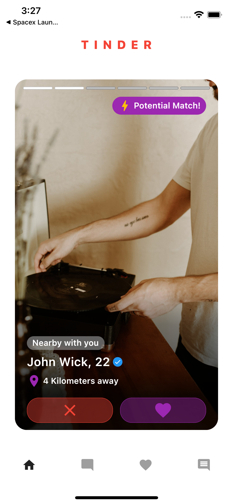

# Tinder App

Tinder dating application developed with Flutter

## Table of contents

- [Overview](#overview)
  - [Screenshot](#screenshot)
  - [Built with](#built-with)
- [Introduction](#introduction)
  - [Screens (UI)](#ui-screens)
  - [Widgets (UI)](#ui-widgets)
  - [Logic](#logic)
  - [Data](#data)
  - [Packages](#packages)
- [Author](#author)

## Overview

### Screenshot

### Built with

Languages:

- Dart
- Flutter

Concepts:

- UI: FutureBuilder, Swipable Stack, Pageview.Builder
- Logic: Bloc Design Patter
- Data: Getting Data and Users from Repository

## Introduction

An app that displays users in Tinder-like swipeable cards.

Features include:

- Getting and randomizing users
- User cards built with Pageview.Builder

### Screens (UI)

There are various pages:

Welcome Page: The page consist of Bottom Navigation Bar  
Home Page: Page that displays users in a swipeable form  
Test Page: Another page with swipeable cards  
Color Page: Just a temporary page for BottomNavBar pages

### Widgets (UI)

Below you can see the list of widgets.

Custom Progress Indicator: The progress indicator to display the loading state  
User Card: The main card that hold user photos and information  
User Layer: The layer that holds the general information for every user  
Bars: The upper bars to display the current index of the photos

### Logic

BLoc design pattern and state managemenet library used for logic.

User Bloc: This will be implemented

### Data

Data is composed of 3 parts: Models, Providers and Repositories

- Data Models:

User Model: User model is implemented here  
User Media Model: User Media model is implemented here

- Data Providers:

User Provider: This will implemented
User Media Provider: This will implemented

- Data Repositories:

User Repository: Prepares the user data  
User Media Repository: Prepares the user media

### Packages

Below you can see the packages used.

flutter_svg: For displaying SVGs  
 swipable_stack: Making user cards swipeable

## Author

Erke Canbazoğlu

- Linkedin - [Erke Canbazoğlu](https://www.linkedin.com/in/erkecanbazoglu/)
- Github - [erkecanbazoglu](https://github.com/erkecanbazoglu)
